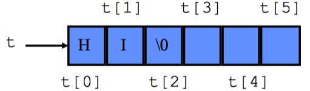

# CStrings

* So far, we've dealt only with string literals such as "Hello, World!", but what if we want to store strings as variables?
* We'll use what's called a _C-style string_ to do this

## CStrings are arrays

* Just any array!
* We can write an array of characters to form a string:

```c
char arr[] = {'H', 'e', 'l', 'l', 'o', ' ', 'W', 'o', 'r', 'l', 'd', '!'};
```

* **But this is is not a C-string**
  * This is an array of characters, but not a C-style string.
* Well what is a C-string?
  * A character array whose final character is the null character `\0`:
* To write "Hello World!" as a C-string:

```c
char arr[] = {'H', 'e', 'l', 'l', 'o', ' ', 'W', 'o', 'r', 'l', 'd', '!', '\0'};
```

* But this is incredibly tedious to define strings this way
* Fortunately, we can assign a character array to string literal to create a C-string

```c
char arr[] = "Hello, World!"; // arr will terminate with a null character.
                              // Null character is automatically added by the compiler
```

* Another example:

```c
char t[5] = "HI";
```



* When we initalize a character using a string literal, the null character is automatically added
  * This means the character array must have enough space for every character of the string plus an additional element for the null character.
    * For instance, if we do the following, we don't end up with a C-string (there's no room for the entire string (and therefore there isn't room for the null character either)

```c
char arr[5] = "Hello, World!"; // arr only stores the first 5 chracters
                               // arr has the values [H', 'e', 'l', 'l', 'o']
```

* But we also don't have to fill up the entire array either, the null-character indicates the end of the string.
* **Bottom line**: a character array is only a character array if it is **null-terminated**, meaning the final character is the null-character
* Why does any of this matter?
  * Strings are an incredibly common data type in real-world data.
  * Storing names, addresses, email addresses, etc all required strings.
  * There is a very large standard library header, called `string.h`, that provides a wide range of functionality.
    * All of this functionality relies on using C-strings, not character arrays.
* Another important note: Strings are **NOT** assignable. We can't do the following

```c
char b[50];
b = "Hello, World!"; // this will error, not assignable
```

* Why not?
  * `b` is basically just a pointer! (Arrays are basically constant pointers)
  * Does it make sense to assign a pointer to a literal? No.
* But we need a way to assign strings.
  * `strcpy` function will help...keep reading.

# String Library

* Large library available for us to use to copy, compare, and manipulate strings.
* This is intended to help you, so you should view this as free functionality (as long as you are willing to read a tiny bit to figure out what the library functions do)
* Include the library with:

```c
#include <string.h>
```

## Important functions

### `strcat`

* Concatenates two strings.
* For instance, "Hello," concatenated with " World!" yields "Hello, World!"

```c
char *strcat(char *dest, const char *src);
```

* Parameters:
  * `dest`: destination array. Current value will be the "start" of the concatenated string.Must be large enought to contain the concatenated string
  * `src`: string to be appended to `dest`
* Return value:
  * Returns a point to `dest` (similar to our `insert_into_array`, it's common for functions to return a pointer to a parameter
* Uses:
  * Allows you to aggregate data into a single variable
* Example:

```c
#include <stdio.h>
#include <string.h>

int main () {
  // want to produce "Hello, World!", so we want to do "Hello," concatenated with " World!"
  char dest[50] = "Hello,";
  char src[50] = " World!";

  // could also assign dest as return value
  strcat(dest, src);

  printf("Final destination string : |%s|\n", dest);

  // What happens if we do this multiple times?
  // this time, we'll assign return value to dest
  char *b = strcat(dest, src);

  printf("Final destination string : |%s|\n", b);

  return 0;
}

```

* But be careful! Must make sure `dest` has enough room for `src` in memory (i.e. the char array must be large enough to hold both strings, plus a null-character)

### `strcmp`

* Performs string comparison
* Similar to an equality operator, such as `>`, `<`, etc, but for strings.
* Useful primarily for determining if two strings are equal

```c
int strcmp(const char *s1, const char *s2);
```

* Parameters:
  * `s1`: first string for comparison
  * `s2`: second string for comparison
* Return value:
  * An integer indicating the relationship between the two strings:
    * `0` indicates the two strings are equal, character by character
    * Negative value indicates the strings do not match. The first character that _doesn't_ match in the strings has a lower lexicographical value in `s1` than `s2`
    * Positive value indicates the strings do not match. The first character that _doesn't_ match in the strings has a greater lexicographical value in `s1` than `s2`
  * If the return value is not `0`, why is it useful to indicate the lexicographical order of the first character that doesn't match?
    * Sorting!
    * We can sort an array of strings (a multi-dimensional array) using this

* Uses:
  * Checking for string equality
  * Sorting
* Example:

```c
#include <stdio.h>
#include <string.h>

int main () {
  // want to produce "Hello, World!", so we want to do "Hello," concatenated with " World!"
  char s1[50] = "testing";
  char s2[50] = "testing";
  char s3[50] = "teasing";
  char s4[50] = "ttesting";

  // comparing s1 and s2
  if(!strcmp(s1,s2)){
    printf("s1 and s2 are equal\n");
  } else {
    printf("s1 and s2 are somehow not equal...\n");
  }

  // comparing s1 and s3
  if(!strcmp(s1,s3)){
    printf("s1 and s2 are somehow equal...\n");
  }
  else if (strcmp(s1,s3) < 0) {
    printf("s1 has lower value for first character that does not match\n");
  }
  else if (strcmp(s1,s3) > 0) {
    printf("s3 has lower value for first character that does not match\n");
  }

  // comparing s1 and s4
  if(!strcmp(s1,s4)){
    printf("s1 and s2 are somehow equal...\n");
  }
  else if (strcmp(s1,s4) < 0) {
    printf("s1 has lower value for first character that does not match\n");
  }
  else if (strcmp(s1,s4) > 0) {
    printf("s4 has lower value for first character that does not match\n");
  }

  return 0;
}
```

### `strcpy`

* Copies content into a string
* Used to perform "assignment" through copying

```c
char *strcpy(char *dest, const char *src);
```

* Parameters:
  * `dest`: destination for copying. Must have enough room for `src`
  * `src`: source for copying. Can be another c-string or a string literal
* Return value:
  * `dest` is returned
* Uses:
  * Assigning literals to strings
  * Copying strings
* Example:

```c
/* strcpy example */
#include <stdio.h>
#include <string.h>

int main()
{
  char str1[]="Sample string";
  char str2[40];
  char str3[40];
  strcpy(str2,str1);
  strcpy(str3,"copy successful");
  printf("str1: %s\nstr2: %s\nstr3: %s\n", str1, str2, str3);
  return 0;
}

```

### `strlen`

* Returns the length of a string
* Means we don't need to pass around the length of a c-string, we can compute the length whenever we need it!

```c
size_t strlen(const char *s);
```

* Parameters:
  * `s`: string to compute the length of
* Return value:
  * The length of the C string, excluding the null character
* Uses:
  * Determining the length of a string
  * Useful when attempting to iterate over every character in a string
* Example:

```c
#include <stdio.h>
#include <string.h>

int main ()
{
  char s1[50] = "Hello, World!";
  char s2[] = "Hello, World!";
  printf("s1 is %lu characters long\n", strlen(s1));
  printf("s2 is %lu characters long\n", strlen(s2));
  return 0;
}
```

### `strtok`

* Tokenizes a string
  * This means it breaks up a string based on a set of delimiters
* Will be EXTREMELY useful for your homework assignment

```c
char *strtok(char *str, const char *delimiters);
```

* Parameters:
  * `str`: string to tokenize.
    * On the first time you call `strtok`, provide the string to tokenize. As you processes each token, pass `NULL`. See example.
  * `delimiters`: set of delimiters to use to break up the string. Every time a character in the delimiters string is seen, the string is "broken" by inserting a null-character in the delimiters place
* Return value:
  * If a token is found, a pointer to the beginning of the token
  * Otherwise, a null pointer. A null pointer will also be returned when strtok hits the end of the string
* Uses:
  * Parsing a string
  * Splitting a string based on a character
  * Very useful to process data!
* Example:

```c
/* strtok example */
#include <stdio.h>
#include <string.h>

int main ()
{
  char str[] ="- This, a sample string.";
  int str_len = strlen(str);
  char * pch;
  printf ("Splitting string \"%s\" into tokens:\n",str);
  // first call to strtok inserts a null character every time a delimiter is seen
  pch = strtok (str," ,.-");
  // pch will be set to null by strtok after processing the last token
  while (pch != NULL)
  {
    printf ("%s\n",pch);
    // advances the pointer to the next token
    pch = strtok (NULL, " ,.-");
  }
  return 0;
}
```

### `fgets`

* Included in `stdio.h`
* Reads a line from standard input (`stdin`) and stores it in a c-string

```c
char *fgets(char *s, int num, FILE *stream);
```

* Parameters:
  * `s`: string used to store the values inputted
  * `num`: max number of characters to be copied into str, including the null-character
  * `stream`: stream to copy into (we will use standard input, `stdin`)
* Return value:
  * Returns a pointer to `s` on success, returns `NULL` on failure or when the end-of-file occurs
* Uses:
  * Getting user input
* Example:

```c
#include <stdio.h>

int main () {
  char str[50];

  printf("Enter a string : ");
  fgets(str, 50, stdin);

  printf("You entered: %s", str);

  return(0);
}
```

### Converting strings to other data types

* A bunch of functions to do this for you (included in `stdlib.h`):
  * `atoi`: string to int
  * `atof`: string to float
  * `atol`: string to long
  * `strtod`: string to double
  * There are some more rare conversions provided by `stdlib` as well

# Exercises

1. Write your own implementation of strlen using the following function prototype (note: you are not allowed to pass in the length of the array, you must compute the length based on the contents of the string)

```c
size_t strlen_in_class(const char *s);
```

```c
#include <stdio.h>
#include <string.h>

size_t strlen_in_class(const char *s);

int main ()
{
  char s1[50] = "Hello, World!";
  char s2[] = "Hello, World!";
  printf("s1 is %lu characters long\n", strlen_in_class(s1));
  printf("s2 is %lu characters long\n", strlen_in_class(s2));
  return 0;
}

size_t strlen_in_class(const char *s){
  size_t len = 0;
  while(*s != '\0'){
    s++;
    len++;
  }
  return len;
}
```

2. Write a function to count the number of words in a string. You may assume a word is separated by a space, tab, or new line. Any other character is assumed to be part of a word.

```c
#include <stdio.h>
#include <string.h>
#include <stdlib.h>

int word_counter(char *str);

int main()
{
  const int str_size = 100;
  char str[str_size];

  printf("Input the string : ");
  fgets(str, str_size, stdin);
  printf("Total number of words in the string is : %d\n", word_counter(str));
  return 0;
}

int word_counter(char *str){
  int count = 0;

  /* loop till end of string */
  while(*str !='\0')
  {
    /* check whether the current character is white space or new line or tab character*/
    /* note that this will count consecutive spaces as multiple words! */
    if(*str == ' ' || *str == '\n' || *str == '\t')
    {
      count++;
    }
    str++;
  }
  return count;
}
```

* Solution using `strtok`

```c
#include <stdio.h>
#include <string.h>
#include <stdlib.h>

int word_counter(char *str);

int main()
{
  const int str_size = 100;
  char str[str_size];

  printf("Input the string : ");
  fgets(str, str_size, stdin);
  printf("Total number of words in the string is : %d\n", word_counter(str));
  return 0;
}

int word_counter(char *str){
  int count = 0;

  // initialize the tokenizer
  char *pch = strtok(str, " \t\n");
  while(pch != NULL){
    // increment our word count
    count++;
    // advance to the next token
    pch = strtock(NULL, " \t\n");
  }
  return count;
}
```