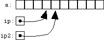

# Pointers & Pass-by-reference

* A **pointer** is a value that designates the address of some value.
* Pointers are variables that hold a memory location as their value
* Remember the address-of operator (`&`) we used with `scanf()`?
  * This operator gets the address of the operand
* Pointers give us a way to save the result of the address-of operator into a variable
  * The type returned by the address-of is a pointer!

## Assigning and dereferencing pointers

* Instead of passing the result of the address-of operator to a function (e.g. `scanf`) let's save the result into a variable

```c
int a = 5;       // declare & initialize an int to the value of 5
int *b = &a;     // declare & initialize a pointer to store the address of the variable a
```

* At this point, `b` doesn't store the value 5. It stores the memory address of the variable `a`. The variable `a` stores the value 5, not `b`.
* But how can we access the value of `a` using the pointer `a`?
  * We use the **dereferencing operator** to tell the computer "take me to the memory location stored by this pointer:

```c
int a = 5;       // declare & initialize an int to the value of 5
int *b = &a;     // declare & initialize a pointer to store the address of the variable a
int c = *b;      // declare & initialize an int to the value of the dereferenced b, which is the value stored by a
```

* The dereference operator is the complement to the address-of operator, similar to how subtraction is the complement to addition

## House analogy

* We are all familiar with houses and the address system we use with the post office
* This is a great parallel to pointers in C.
* We can think of variables as houses (a very large box to store data in - but we won't worry about the size of the house right now).
* We can think of memory address as addresses
  * Do addresses have houses of their own? NO!
  * But when we declare a pointer, we make a house specifically to store an address
* Some questions (credit, though this is for C++  [http://alumni.cs.ucr.edu/~pdiloren/C++_Pointers/wherelive.htm](http://alumni.cs.ucr.edu/~pdiloren/C++_Pointers/wherelive.htm)):

### Where do you live? (&)

* Suppose we have the following code:

```c
int paul = 21;        // store the value 21 in paul's house
int tom = paul;       // store the value in paul's house in tom's house (makes a copy)
int *melissa = &paul; // store address of paul in melissa's house
```

* And suppose paul's address is 1500.
* What is the value stored in melissa's house?
  * 1500
  * melissa's house stores a pointer
* Let's look at this as a diagram:


### What's in your house? (*)

* Suppose we continue our example above and write the following:

```c
int dave = *melissa; // stores the value 21 in dave's house
```

* How did 21 get into dave's house?
  * Dave asks melissa what value she is storing.
  * Melissa tell's dave "1500".
  * Dave knows melissa's house stores a pointer, so he then goes to the address 1500 and ask whoever is there what value is inside (notice, dave doesn't know that 1500 is paul's house)
  * Dave then stores 21 in his house


* Now suppose we execute the following line:

```c
*melissa = 30;
```

* How do the houses update?
  * paul's house is updated to store 30
  * melissa's house stays the same
  * dave's house stays the same
    * dave lives in a different house than paul, and the contents of dave's house don't change when the contents of paul's house change

## NULL pointers

* For most variable types, we have a default value we typically use by default. For instance, 0 is the default type for `int`.
* Pointers have no explicit default type (meaning will value will be garbage if you do not initialize the pointer when you declare it).
* We use a special marco (preprocessor definition) called `NULL` to indicate that this pointer does not point to any memory address:

```c
int *ptr = NULL; // does not point to anything
//now we can check if the pointer is safe to dereference (because it actually points to something)
if(ptr != NULL){
  *ptr = 5; // safe to dereference
}
```

* If we don't make sure we properly initialize a pointer to a memory address

## Stress-testing your understanding of pointers:

* What if we wanted a pointer to a pointer that points to an int?
  * This means the data type of this variable/house would point to a memory address that points to the memory address of an int

```c
int a = 5;
int *ptr = &a;
int **ptr2ptr = &ptr;
```

* We can continue doing this over and over to get "deeper" into what points to what
* Consider this complicated example:

```c
int *p1, *p2, **p3, a = 5, b = 10;
p1 = &a;
p2 = &b;
p3 = &p2;
*p1 = 10;
p1 = p2;
*p1 = 20;
**p3 = 0;
printf("%i %i %i %i %i\n", *p1, *p2, **p3, a, b);
Answer:
0 0 0 10 0

```

## Arrays and pointers

* Arrays represent contiguous blocks of computer memory. Each element of an array is placed immediately next to the preceding/next element of the array in memory.
* Pointers and arrays are deeply and somewhat confusingly linked. There's two basic rules:

1. A variable declared as an array of some type acts as a pointer to that type. When used by itself, it points to the first element of the array.
2. A pointer can be indexed like an array name. We can use `[]` with pointers the same way we use array names.

* Array names can be thought of as constant pointers, meaning the address they store cannot change, but the contents at that address can change
  * `int *const const_ptr` creates a constant pointer to a non-constant int
  * There's a nifty trick called the 'backwards spiral rule' that makes reading these declarations a lot easier (you don't need to know/study this, just providing for additional info) [http://c-faq.com/decl/spiral.anderson.html](http://c-faq.com/decl/spiral.anderson.html)


### Arrays as pointers

* This occurs primarily when arrays are passed into/returned from functions (remember how we returned an array from a function? We used a pointer).

```c
 /* two equivalent function definitions */
 int func(int *paramN);
 int func(int paramN[]);
```

* Pointers and array names can be used almost interchangeably. There are a few exceptions/things to keep in mind:
    1. You cannot assign a new pointer value to an array name (since the array name is a constant value, and therefore immutable/non-modifiable).
    2. The array name will always point to the first element of the array.

### Pointer arithmetic

* We can add/subtract integer values from pointers. This is called **pointer arithmetic**.
* This is relevant for iterating over arrays using a pointer and pointer arithmetic
* The following two expressions are equivalent:

```c
*(arr+j)  // access element using pointer arithmetic
arr[j];   // access element using [] operator
```

* What does the first expression do?
  * Adds `j*sizeof(arr type)` to arr, and then dereferences that memory location
  * For instance, if we have an array of `int`s, each array element is 4 bytes long.
  * If `arr` starts at address 3500, the 5th element is located at memory address 3500+(5*sizeof(int)).
  * Notice the `sizeof()` was not explicit, the compiler will automatically multiply `j` by the size of each member of the array
* Consider the following (figures, etc taken from [here](https://www.eskimo.com/~scs/cclass/notes/sx10b.html)):

```c
int *ip;
int a[10];
ip = &a[3];
```

* `ip` would end up pointing to the forth element of `a`.


* Now suppose we wrote

```c
ip2 = ip + 1;
```

* Then we'd have:



#### Knowledge check

```c
#include <iostream>

int main()
{
  int array [5] = { 9, 7, 5, 3, 1 };

  printf("%p\n", (void*) &array[1]); // print memory address of array element 1, must cast to void pointer to print
  printf("%p\n", (void*) array+1); // print memory address of array pointer + 1

  printf("%d\n", array[1]); // prints 7
  printf("%d\n", *(array+1)); // prints 7 (note the parenthesis required here)

  return 0;
}
```

#### Iteration using pointer arithmetic

* We can use pointer arithmetic to iterate over an array, instead of using integer indices

```c
const size_t arr_len = 7;
char name[arr_len] = "Mollie";
int numVowels(0);
// initialize the pointer to the beginning of the array
// condition is whether or not the pointer has past the last valid memory address for the array (name + arr_len)
// loop statement incrementing the pointer to the next element in the array
for (char *ptr = name; ptr < name + arr_len; ++ptr)
{
  switch (*ptr)
  {
    case 'A':
    case 'a':
    case 'E':
    case 'e':
    case 'I':
    case 'i':
    case 'O':
    case 'o':
    case 'U':
    case 'u':
        ++numVowels;
  }
}
```

## Pass-by-reference

* Basic idea: instead of copying arguments to a function, use the same underlying memory location to pass values into a function (i.e. instead of duplicating a house when calling a function, use the same house).
* Many other languages support a concept called passing-by-reference
* C always uses pass-by-value, which means when we write:

```c
int dummy_func(int param){
  // this modification doesn't affect the variable that was passed into the function
  param++;
  return param;
}

int main(){
  int a = 5;
  int b = dummy_func(a); // a is copied to dummy_func
  // since a was copied (and then the copied value was modified in dumm_func, then returned), the value of a in main does not change
  printf("a: %d, b: %d\n", a, b);
}
```

* Pass-by-reference prevents the value from being copied and instead tells the function to directly modify the variable stored in the caller's scope
  * This is clearly useful!
  * So far, we've only been able to return a single data type, but if we can modify parameters in the caller's scope, we have a way to "return" multiple values by telling the parameters "not to copy" into the function's scope.
* But C does not support this.
* Fortunately, pointers are just memory addresses.
* If you copy a pointer, the memory location says the same.
* This means we can create pass-by-reference behavior by passing pointers to functions
  * The pointers are copied into the function, but if we dereference and modify their value, we aren't changing the pointer, but the contents the pointer refers to.
  * This is essentially pass-by-reference behavior
  * In the notes on arrays, we actually never needed to return the array! For instance:

```c
//NOTICE: the asterisk (star) next to int indicates we are returning an array
int* add_to_zeroth_element(int arr[], size_t arr_len, int value){
  // this is just a dummy array operation, in practice you'll do wonderful and amazing things here
  arr[0] += value;
  // NOTICE: return the array, we don't use [] here, just the name of the array.
  return arr;
}

void add_to_zeroth_element_no_return(int *const arr, size_t arr_len, int value){
  // this is just a dummy array operation, in practice you'll do wonderful and amazing things here
  arr[0] += value;
  // don't need
}

int main(){
  int arr[] = {1,2,3};
  // notice the type here has to match the return type of the function. Exactly what's going on here will be covered with pointers.
  int* result = add_to_zeroth_element(arr, 3, 5);

  for (j = 0; j < 3; ++j)
  {
    printf("%d  ", arr[j]);
  }

  // increment once more on the first element, no return
  add_to_zeroth_element_no_return(arr, 3, 5);

  for (j = 0; j < 3; ++j)
  {
    printf("%d  ", arr[j]);
  }
}
```

## Exercises

1. Write a program in C to add two numbers using pointers.
Test Data :
Input the first number : 5
Input the second number : 6
Expected Output :
The sum of the entered numbers is : 11

```c
#include <stdio.h>
int main()
{
   int first, second, *ptr, *qtr, sum;

   printf(" Input the first number : ");
   scanf("%d", &first);
   printf(" Input the second  number : ");
   scanf("%d", &second);

   ptr = &first;
   qtr = &second;

   sum = *ptr + *qtr;

   printf(" The sum of the entered numbers is : %d\n\n",sum);

   return 0;
}
```

2. Write a program in C to print the elements of an array in reverse order using pointers

```c
#include <stdio.h>
int main()
{
  int n, i, arr[15];
  int *ptr;

  printf(" Input the number of elements to store in the array (max 15) : ");
  scanf("%d",&n);
  ptr = &arr[0];  // ptr stores the address of base array arr1
  printf(" Input %d number of elements in the array : \n",n);
  for(i=0; i<n; i++)
  {
    printf(" element - %d : ",i+1);
    scanf("%d",ptr);//accept the address of the value
    ptr++;
  }

  // print the contents
  for (ptr = arr + n - 1; ptr >= arr; ptr--){
    printf("%d ", *ptr);
  }
  printf("\n");
}

```

3. Create a function `print_addr(int x)` whose sole purpose is to print the address of the integer `x` passed to it. Create an integer variable in `main`, print out its address, and then pass that variable to `print_addr`. Compare the results. Is this expected behavior?
