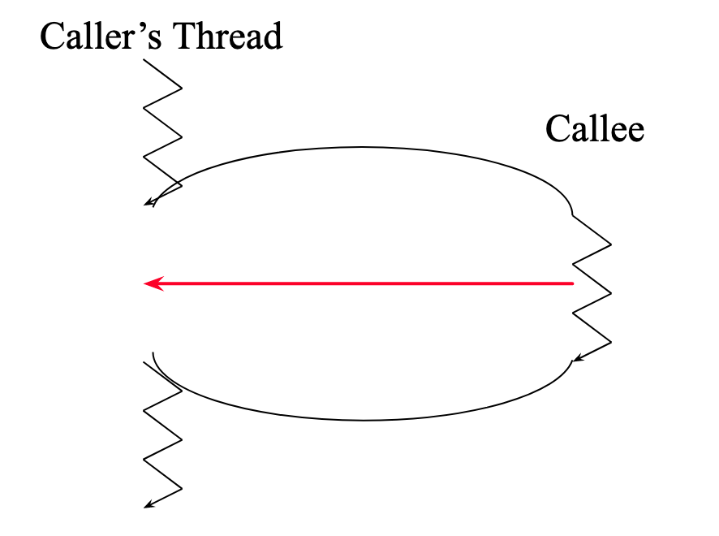

## Chapter 16: Exception Handling

Instructor: Mark Edmonds

<edmonds_mark@smc.edu>

## Exceptions

- Exceptions are a simple concept, but a powerful one.
- So far, if our program has runtime problem (error), we have no way to handle or correct it.
  - Imagine if every program you ran immediately crashed upon a problem (e.g. the internet was not connect, a hard drive was removed, etc). Very hard to use a computer!
  - You may remember older programs that would crash and say "Program exited with code 47" (or some other code) without providing much detail.
    - These were unhandled exceptions, and the program crashing was the way to "fix" the problem by not allowing more problems to occur in a bad program state.
- In the programs we've written, you can imagine having issues in a number of ways:
  - A user could pass the wrong parameters to a function
  - Data files that need to be opened for reading or writing could not exist
  - ...just about anything you can imagine could go wrong, may go wrong

## BankAccount Exceptions

- Suppose we want to use the `+` operator to add two `BankAccount`s together.
- This only makes sense if the accounts are owned by the same person
- But what if the user tries to add two bank accounts together that belong to different people?

```cpp
BankAccount operator+ (const BankAccount& b1, const BankAccount& b2){
   BankAccount result;
   if (b1.my_Name == b2.my_Name) {
      result = BankAccount(b1.my_Name, b1.my_Balance + b2.my_Balance);
   }
   return result;
}
```

- If the user passes two bank accounts that match as arguments, this works great
- If the user passes two bank accounts that don't match as arguments, this doesn't work well
  - We return an uninitialized bank account, but is that the behavior we really want?
  - How can the user tell whether or not the operation (adding two bank accounts) succeeded?
    - What if both bank accounts were empty...?
- This is problematic, because it excepts the user to be able to interpret a default-initialized bank account as an error
  - The function still returns a value when we really encountered an error - probably not the behavior we want
  - What if we could inform the user of an error in a different way, that didn't require a special interpretation of an otherwise "normal" execution during an error?
    - This is what exceptions are for!

## Caller-Callee Relationship revisited

- Remember our Caller-Callee relationships for functions:



- The red line indicates that we could return to the Caller function during the Callee's execution if we encounter an error
- An exception is an "alternate" return mechanism to designate an error
- The caller then must handle the exception some way, or the program will crash
- Sending an exception to the caller is called "throwing" an exception
- Receiving and handling the exception in the caller is called "catching" an exception
- So the Callee can throw an exception, and if the Caller doesn't catch the exception, then the program crashes
  - The analogy is like playing catch with a ball, except if the ball is dropped, the program crashes.

## Throwing Exceptions

- To throw an exception, we'll use the `throw` statement:

```cpp
throw(std::logic_error("Always write a description of the problem as the argument to the logic_error constructor"))
```

- This is like a return statement, in the sense we "pass" a value back to the caller
- `std::logic_error` is a class
  - `#include <stdexcept>` to use it
  - We'll eventually learn how to write our own exceptions, but for now, we can use the ones defined by the Standard Library

## Catching Exceptions

- The caller needs to `try { }` to execute some code that may produce an error and `catch () { }` any errors that occur
  - You can have as many `catch` statements as necessary (meaning you can put multiple, similar to multiple `else if` statements)

```cpp
try {
  // execute code that could throw an exception inside of a "try" block
  some_function_that_may_throw_a_logic_error();
} catch (std::logic_error e) {
  // catch the exception, and do some error recovery procedure.
  // In this case, we just print out the exception message
  cout << e.what() << endl; // e.what() will return the message associated with the exception
}
```

## Example: `BankAccount` with exceptions

- This example shows how to throw and use exceptions to process potentially invalid data in a loop.
- To cause an exception to be thrown, do the following:
  1. *Create* an account
  2. *Deposit* or *Withdraw* and use a different name than the name you used when you created the account

## Example: [`ExceptionBankAccount.h`](../examples/ch16_exceptions/1-exceptionbanker/ExceptionBankAccount.h)

```{include=../examples/ch16_exceptions/1-exceptionbanker/ExceptionBankAccount.h}
```

## Example: [`ExceptionBankAccount.cpp`](../examples/ch16_exceptions/1-exceptionbanker/ExceptionBankAccount.cpp)

```{include=../examples/ch16_exceptions/1-exceptionbanker/ExceptionBankAccount.cpp}
```

## Example: [`ExceptionBanker.cpp`](../examples/ch16_exceptions/1-exceptionbanker/ExceptionBanker.cpp)

```{include=../examples/ch16_exceptions/1-exceptionbanker/ExceptionBanker.cpp}
```

- This is a good example because classes typically throw exceptions to indicate failure
- This is sense, the class is typically the callee and the user of the class is the caller

## Auto example

- Exceptions are good because they allow you to greatly simplify your error checking using a consistent system that handles all error checking in one place
- To illustrate this, let's consider the following example
- We'll imagine we have a `Car` class that can fail for a number of reasons, each of which is specific to a reasonable real-world circumstance a car may face

## Example: [`auto_if.cpp`](../examples/ch16_exceptions/2-Auto/auto_if.cpp)

```{include=../examples/ch16_exceptions/2-Auto/auto_if.cpp}
```

## Example: [`auto_exception.cpp`](../examples/ch16_exceptions/2-Auto/auto_exception.cpp)

- The above is rather hard to read, hard to maintain, and hard to expand
- Consider the following similar approach using exceptions

```{include=../examples/ch16_exceptions/2-Auto/auto_exception.cpp}
```

