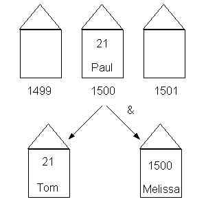
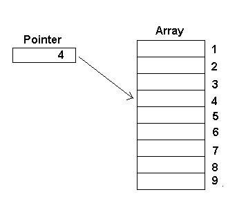

## Chapter 9: Strings & Vectors

Instructor: Mark Edmonds

<edmonds_mark@smc.edu>

## Pointers

- A **pointer** is a value that designates the address of some value.
- Pointers are variables that hold a memory location as their value
- The address-of operator (`&`) will return the address (memory location) of a variable
  - This operator gets the address of the operand
- Pointers give us a way to save the result of the address-of operator into a variable
  - The type returned by the address-of is a pointer!
- If you are familiar with C, pointers in C++ are identical to pointers in C

## Assigning and dereferencing pointers

- We save pointers into variable

```cpp
int a = 5;       // declare & initialize an int to the value of 5
int *b = &a;     // declare & initialize a pointer to store the address of the variable a
```

- At this point, `b` doesn't store the value 5. It stores the memory address of the variable `a`. The variable `a` stores the value 5, not `b`.
- But how can we access the value of `a` using the pointer `b`?
  - We use the **dereferencing operator** (`*`) to tell the computer "take me to the memory location stored by this pointer":

```cpp
int a = 5;       // declare & initialize an int to the value of 5
int *b = &a;     // declare & initialize a pointer to store the address of the variable a
int c = *b;      // declare & initialize an int to the value of the dereferenced b, which is the value stored by a
```

- The dereference operator (`*`) is the complement to the address-of operator (`&`), similar to how subtraction is the complement to addition

## House analogy

- We are all familiar with houses and the address system we use with the post office
- This is a great parallel to pointers in C++.
- We can think of variables as houses (a very large box to store data in - but we won't worry about the size of the house right now).
- We can think of memory address as addresses
  - Do addresses have houses of their own? NO!
  - But when we declare a pointer, we make a house specifically to store an address
- Lets think about some questions using the analogy
- (credit to [http://alumni.cs.ucr.edu/~pdiloren/C++_Pointers/wherelive.htm](http://alumni.cs.ucr.edu/~pdiloren/C++_Pointers/wherelive.htm) for this analogy and these figures)

### Where do you live? (`&`)

- Suppose we have the following code:

```cpp
int paul = 21;        // store the value 21 in paul's house
int tom = paul;       // store the value in paul's house in tom's house (makes a copy)
int *melissa = &paul; // store address of paul in melissa's house
```

- And suppose paul's address is 1500.
- What is the value stored in melissa's house?
  - 1500
  - melissa's house stores a pointer
- Let's look at this as a diagram:



### What's in your house? (`*`)

- Suppose we continue our example above and write the following:

```cpp
int dave = *melissa; // stores the value 21 in dave's house
```

- How did 21 get into dave's house?
  - Dave asks melissa what value she is storing.
  - Melissa tell's dave "1500".
  - Dave knows melissa's house stores a pointer, so he then goes to the address 1500 and ask whoever is there what value is inside (notice, dave doesn't know that 1500 is paul's house)
  - Dave then stores 21 in his house


- Now suppose we execute the following line:

```cpp
*melissa = 30;
```

- How do the houses update?
  - paul's house is updated to store 30
  - melissa's house stays the same
  - dave's house stays the same
    - dave lives in a different house than paul, and the contents of dave's house don't change when the contents of paul's house change

## NULL pointers

- For most variable types, we have a default value we typically use by default. For instance, 0 is the default type for `int`.
- Pointers have no explicit default type (meaning will value will be garbage if you do not initialize the pointer when you declare it).
- We use a special marco (preprocessor definition) called `NULL` to indicate that this pointer does not point to any memory address:

```cpp
int *ptr = NULL; // does not point to anything
//now we can check if the pointer is safe to dereference (because it actually points to something)
if(ptr != NULL){
  *ptr = 5; // safe to dereference
}
```

- Starting in C++11, we can also use `nullptr` instead of `NULL`

```cpp
int *ptr = nullptr; // does not point to anything
//now we can check if the pointer is safe to dereference (because it actually points to something)
if(ptr != nullptr){
  *ptr = 5; // safe to dereference
}
```

- If we don't make sure we properly initialize a pointer to a memory address

## Stress-testing your understanding of pointers

- What if we wanted a pointer to a pointer that points to an int?
  - This means the data type of this variable/house would point to a memory address that points to the memory address of an int

```cpp
int a = 5;
int *ptr = &a;
int **ptr2ptr = &ptr;
```

- We can continue doing this over and over to get "deeper" into what points to what
- Consider this complicated example:

```cpp
int *p1, *p2, **p3, a = 5, b = 10;
p1 = &a;
p2 = &b;
p3 = &p2;
*p1 = 10;
p1 = p2;
*p1 = 20;
**p3 = 0;
cout << *p1 << " " << *p2 << " " << **p3 << " " << a << " " << b << endl;
Answer:
0 0 0 10 0
```

## Arrays and pointers

- Arrays represent contiguous blocks of computer memory. Each element of an array is placed immediately next to the preceding/next element of the array in memory.
- Pointers and arrays are deeply and somewhat confusingly linked. There's two basic rules:

1. A variable declared as an array of some type acts as a pointer to that type. When used by itself, it points to the first element of the array.
2. A pointer can be indexed like an array name. We can use `[]` with pointers the same way we use array names.

- Array names can be thought of as constant pointers, meaning the address they store cannot change, but the contents at that address can change
  - `int *const const_ptr` creates a constant pointer to a non-constant int
  - There's a nifty trick called the 'backwards spiral rule' that makes reading these declarations a lot easier (you don't need to know/study this, just providing for additional info) [http://c-faq.com/decl/spiral.anderson.html](http://c-faq.com/decl/spiral.anderson.html)



### Arrays as pointers

- This occurs primarily when arrays are passed into/returned from functions (remember how we returned an array from a function? We used a pointer).

```cpp
 /* two equivalent function definitions */
 int func(int *paramN);
 int func(int paramN[]);
```

- Pointers and array names can be used almost interchangeably. There are a few exceptions/things to keep in mind:
    1. You cannot assign a new pointer value to an array name (since the array name is a constant value, and therefore immutable/non-modifiable).
    2. The array name will always point to the first element of the array.

### Pointer arithmetic

- We can add/subtract integer values from pointers. This is called **pointer arithmetic**.
- This is relevant for iterating over arrays using a pointer and pointer arithmetic
- The following two expressions are equivalent:

```cpp
*(arr+j)  // access element using pointer arithmetic
arr[j];   // access element using [] operator
```

- What does the first expression do?
  - Adds `j*sizeof(arr type)` to arr, and then dereferences that memory location
  - For instance, if we have an array of `int`s, each array element is 4 bytes long.
  - If `arr` starts at address 3500, the 5th element is located at memory address 3500+(5*sizeof(int)).
  - Notice the `sizeof()` was not explicit, the compiler will automatically multiply `j` by the size of each member of the array
- Consider the following (figures, etc taken from [here](https://www.eskimo.com/~scs/cclass/notes/sx10b.html)):

```cpp
int *ip;
int a[10];
ip = &a[3];
```

- `ip` would end up pointing to the forth element of `a`.


- Now suppose we wrote

```cpp
ip2 = ip + 1;
```

- Then we'd have:


#### Knowledge check

```cpp
#include <iostream>

using namespace std;

int main()
{
  int array [5] = { 9, 7, 5, 3, 1 };

  cout << (void*) &array[1] << endl; // print memory address of array element 1, must cast to void pointer to print
  cout << (void*) (array+1) << endl; // print memory address of array pointer + 1

  cout << array[1] << endl; // prints 7
  cout << *(array+1) << endl; // prints 7 (note the parenthesis required here)

  return 0;
}
```

#### Iteration using pointer arithmetic

- We can use pointer arithmetic to iterate over an array, instead of using integer indices

```cpp
const size_t arr_len = 7;
char name[arr_len] = "Mollie";
int numVowels(0);
// initialize the pointer to the beginning of the array
// condition is whether or not the pointer has past the last valid memory address for the array (name + arr_len)
// loop statement incrementing the pointer to the next element in the array
for (char *ptr = name; ptr < name + arr_len; ++ptr)
{
  switch (*ptr)
  {
    case 'A':
    case 'a':
    case 'E':
    case 'e':
    case 'I':
    case 'i':
    case 'O':
    case 'o':
    case 'U':
    case 'u':
        ++numVowels;
  }
}
```

## Pointers and Pass-by-reference

- In C++, we can also effective pass-by-reference by passing a pointer to a variable.
  - In the callee function, dereferencing the pointer will effectively give us access to the variable in the caller.
- Consider the following pass-by-value, then we will look at passing-by-reference using pointers

```cpp
#include <iostream>

using namespace std;

int dummy_func(int param){
  // this modification doesn't affect the variable that was passed into the function
  param++;
  return param;
}

int main(){
  int a = 5;
  int b = dummy_func(a); // a is copied to dummy_func
  // since a was copied (and then the copied value was modified in dumm_func, then returned), the value of a in main does not change
  cout << "a: " << a << ", b: " << b << endl;
}
```

- Remember: pointers are just memory addresses.
- If you copy a pointer, the memory location says the same.
- This means we can create pass-by-reference behavior by passing pointers to functions
  - The pointers are copied into the function, but if we dereference and modify their value, we aren't changing the pointer, but the contents the pointer refers to.
  - This is essentially pass-by-reference behavior
- Let's convert our `dummy_func` to pass-by-reference using pointers:

```cpp
#include <iostream>

using namespace std;

int dummy_func(int* param){
  // this modification doesn't affect the variable that was passed into the function
  (*param)++;
  return (*param);
}

int main(){
  int a = 5;
  int b = dummy_func(&a); // memory address of a is copied to dummy_func
  // since a was passed as a pointer, the value of a is changed in main
  cout << "a: " << a << ", b: " << b << endl;
}
```

- In the notes on arrays, we actually never needed to return the array! For instance:

```cpp
//NOTICE: the asterisk (star) next to int indicates we are returning an array
int* add_to_zeroth_element(int arr[], size_t arr_len, int value){
  // this is just a dummy array operation, in practice you'll do wonderful and amazing things here
  arr[0] += value;
  // NOTICE: return the array, we don't use [] here, just the name of the array.
  return arr;
}

void add_to_zeroth_element_no_return(int *const arr, size_t arr_len, int value){
  // this is just a dummy array operation, in practice you'll do wonderful and amazing things here
  arr[0] += value;
  // don't need to return the array, since the array is effectively passed-by-reference
}

int main(){
  int arr[] = {1,2,3};
  // notice the type here has to match the return type of the function. Exactly what's going on here will be covered with pointers.
  int* result = add_to_zeroth_element(arr, 3, 5);

  for (j = 0; j < 3; ++j)
  {
    cout << arr[j] << " ";
  }
  cout << endl;

  // increment once more on the first element, no return
  add_to_zeroth_element_no_return(arr, 3, 5);

  for (j = 0; j < 3; ++j)
  {
    cout <<  arr[j] << " ";
  }
  cout << endl;
}
```

## Pointers and classes

- When we use pointers with classes, we'll use a new operator `->` to access member attributes (data) and methods.
- Consider our `BankAccount` class. Instead of accessing members with the `.` operator, we'll use the `->` operator when we have a pointer.

```cpp
#include <iostream>

using namespace std;

int main(){
  BankAccount bank1("mark", 1000);
  // declare a pointer to our bank account
  BankAccount* bank1ptr = &bank1;
  // when we use our normal bank1 object, we can use the . operator to access members:
  cout << bank1.balance() << endl;
  // when we use a pointer to a bank account object, we use the -> operator to access members:
  cout << bank1ptr->balance() << endl;
  // the line above is equivalent to dereferencing the pointer using the * operator and using our . operator to access members:
  cout << (*bank1ptr).balance() << endl;
}
```

## The `new` keyword & heap memory

- So far, we have used a form of memory located on the *stack*. This means when the scope in which a variable is declared completes, that variable will be destroyed and its memory is freed.
- For instance, consider the following

```cpp
#include <iostream>

using namespace std;

void dummy_func(int param){
  int c = param + 10;
  cout << c << endl;
}

int main(){
  int a = 5;
  dummy_func(a);
}
```

- Here, `c` is only in scope inside of the `dummy_func` function. It does not exist in `main`.
- Once `dummy_func` finishes, `c` goes out of scope, and the memory is freed.
- This is how all memory on the *stack* behaves. Variables in stack memory exist for as long as they are in scope, and then are freed when they go out of scope.
- However, we can use a different type of memory to have values exist beyond the scope in which they are declared. That memory is called the *heap*.
  - Memory on the heap is managed explicitly by us. We must allocate and deallocate memory on the heap.
- To use the heap, we'll need to use pointers and a new keyword called `new`. `new` is an instruction to allocate memory on the heap. Every time you allocate memory with `new`, it will return a pointer to the type of memory being allocated.
- Note that heap-allocated memory is also called *dynamic memory*, and allocating memory on the heap is called *dynamic allocation*
- The basic syntax for allocating memory on the heap is `pointer-variable = new data-type;`
- Let's look at a simple example:

```cpp
#include <iostream>

using namespace std;

int main(){
  int* a = new int; // allocate an integer on the heap
  *a = 6; // assign the value 6 to our heap-allocated integer, using the pointer a to access the memory
}
```

- We can do this with more complicated types, such as classes we define. Consider our `BankAccount` class we defined:

```cpp
#include <iostream>

using namespace std;

int main(){
  // this bank account is allocated on the heap
  BankAccount* mark_acc = new BankAccount("mark", 1000);
  cout << mark_acc->balance() << endl;
}
```

- To deallocate memory on the heap, we use teh `delete` keyword
- Deallocating memory on the heap has the following syntax `delete pointer-variable;`
- Whenever you deallocate memory on the heap, always immediately assign the pointer to `NULL` or `nullptr`
- Here's a basic example of deallocating memory

```cpp
#include <iostream>

using namespace std;

int main(){
  // this bank account is allocated on the heap
  BankAccount* mark_acc = new BankAccount("mark", 1000);
  cout << mark_acc->balance() << endl;
  // deallocate memory
  delete mark_acc;
  // assign pointer to null, it now pointers to a garbage memory location
  mark_acc = nulltpr;
}
```

### Memory leaks

- In the example above, we allocated memory of the heap with `new BankAccount(...)`, and this returns a pointer to the newly-allocated heap memory
- This memory address is then stored in the variable `mark_acc`, which is declared as a pointer. **The pointer `mark_acc` exists on the stack. It does not exist on the heap**
  - Think about this for a second. We allocate memory on the heap with `new`. The `new` operator returns a pointer. That memory address is then assigned to a pointer variable in scope in the current function.
- So, what happens if our pointer goes out of scope (i.e. is automatically deallocated) before we call delete?
  - We lose access to our heap-allocated memory! And we have no way to get it back! It's floating out there, wasting space.
  - The only way to reclaim the lost memory is to restart the program
  - As an analogy to the real world, imagine a random person gives you a house. They only give you the address to the house on a piece of paper. You lose the piece of paper. Now you have no way to go claim your house, but the house still exists somewhere. This is the same thing that happens to memory in a computer, and you don't want to go around losing houses!
- Allocating memory on the heap and losing access to it before deallocation is called a *memory leak*
- Consider the following:

```cpp
#include <iostream>

using namespace std;

int dummy_func(){
  int* c = new int;
  *c = 6;
  return *c;
}

int main(){
  int b = dummy_func(a);
  // we lost all access to our dynamically-allocated int! We have no way to regain access to it and deallocate it
}
```

- Our pointer `c` goes out of scope at the end of `dummy_func`, but it wasn't deallocated. In `main`, we have no way to deallocate it, because we no longer have the pointer.
- To fix this, we always have to deallocate our memory once we are done using it. In the previous example, I would fix this with the following (assuming we were forced to use dynamically allocated memory):

```cpp
#include <iostream>

using namespace std;

int* dummy_func(){
  int* c = new int;
  *c = 6;
  return c;
}

int main(){
  int* b = dummy_func(a);
  // by returning a pointer a the dynamically-allocated int, we can deallocate it in main!
  delete b;
  b = nullptr;
}
```

<!-- ## New pointers - `unique_ptr` and `shared_ptr`

- C++11 introduced two new classes to help work with points in a more object-oriented way.
- This information is a bit more advanced, but it is good to note (so don't expect to see it mentioned much on quizzes and tests)
- The first is called `unique_ptr` and it is used when a pointer should be unique.
  - This pointer cannot be copied or assigned to another variable (ownership of the pointer can be transferred using `std::move()`)
  - It should be used when you are confident you only want to refer to a pointer a single time. -->