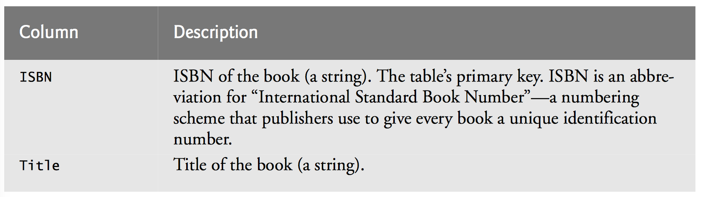
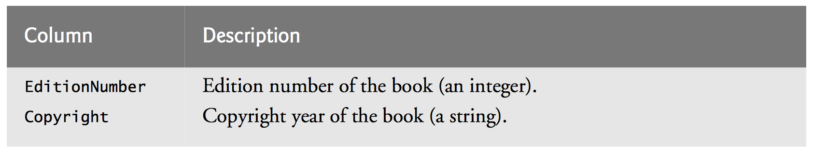
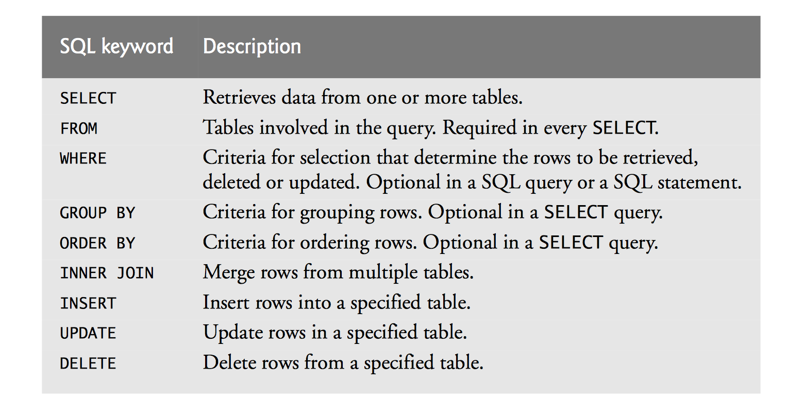

#### What is a database?
A more-structured, multi-sheet excel spreadsheet

We call an excel sheet a **table**, which has rows and columns of data
* Each table contains a columdn with **primary keys**. Each row has a unique value for the primary key's column
    * This guarantees that each row has at least one unique value
    * Means we can identify and access a row uniquely
    * Examples of primary keys: ID numbers, social security numbers, etc
    
We access data in a database through a **query**, which is just a request of information from a table
* In this class, we will use SQL queries 


Some general observations:
* Rows are not guaranteed to be stored in any particular order
* Any column value *except* the primary key may exist in multiple rows
* Each column represents a different data attribute
* Each row is typically unique
* Typically we won't be interested in all the rows, and typically we won't be interested in all the columns of the rows we are interested in
* We can have multiple tables in a database
    * When a primary key is used as a column in a different table, it is called a **foreign key**. This is important for linking tables together; without this mechanism we wouldn't have a way to guarantee unique links between tables

An example query result: show where each department is located in increasing order by department number


The Rule of Referential Integrity
* A guarantee that every foreign key is used as a primary key in a different table
* We can determine if a particular row in a table is valid; e.g. it's foreign key exists in a different table as a primary key
* This also enables **joining**, where we bring data from multiple tables together; the foreign key acts as the link between the tables

## A Books database
Consists of three tables: `Authors`, `AuthorISBN`, and `Titles`.

### Authors Table
* Contains information about authors
* AuthorID is the primary key


### AuthorISBN Table
* Maintains AuthorID's and ISBNs
* ISBN is a foreign key - it is the primary key in the Title table
* AuthorID is a foreign key - it is the primary key in the Authors table
* Primary key is the combination of the two foreign keys - guaranteed to be unique


### Titles Table
* Maintains information about ISBNs and Titles
* ISBN is the primary key
* Title is a string






### Table Relationships


* Italics indicate a primary key
* Lines between tables indicate how tables are connected
* Numbers indicate the degree of the connection
    * E.g AuthorID is unique in the Authors table, but may be used multiple times in the AuthorISBN table
* AuthorISBN provides a *many-tomany relationship* between Authors and Titles
    * An author can write many books and a book can have many authors 

## SQL

SQL is a means to query, or access, information in a database
* SQL is a bit of a language in itself, people make careers out of being SQL wizards



Query Structure:
* Specify the columns we want with `SELECT`
* Specify the tables to get the data from with `FROM`
* Specify additional criteria with `WHERE`

Example for the Books database:

```
SELECT AuthorID, LastName 
    FROM Authors
```

* Gets the AuthorID and LastName from the Authors table


A more complicated example:

```
SELECT Title, EditionNumber, Copyright 
    FROM Titles
    WHERE Copyright > '2010'
```


Note: SQL strings are always single quoted ('), not double quoted (")
Note: A wildcard (`*`) may be used to select all columns, e.g. `SELECT * FROM Titles` selects all columns from the Titles table

#### Pattern Matching
* The `WHERE Copyright > '2010'` line above uses an operator `>`
    * We also have the `<, >, <=, >=, =, !=` and `LIKE`
* `LIKE` indicates a pattern matching qualification on a query
* The percent sign (`%`) indicates a search for zero or more characters at the percent character's position (a wildcard)
* The underscore (`_`) indicates a single wildcard at the position of the underscore

Examples:
Select all authors whose last name begins with a 'D'
```
SELECT AuthorID, FirstName, LastName
    FROM Authors 
    WHERE LastName LIKE 'D%'
```
Select all authors whose last name starts with any character, followed by an 'o', followed by any number of additional characters
```
SELECT AuthorID, FirstName, LastName 
    FROM Authors 
    WHERE LastName LIKE '_o%'
```

#### Ordering
* We can add a qualifier to sort the query's result through `ORDER BY`
* Can sort by ascending (ASC), descending (DESC)
    * Defualt sorting order is by ascending (so if you don't specify, ascending order will be used 
* Can order by multiple columns - sorts by outer sort first, then each additional sorting specified (e.g. last name then by first name)
Form:
```
SELECT columnName1, columnName2, … 
    FROM tableName 
    ORDER BY column ASC 
SELECT columnName1, columnName2, … 
    FROM tableName 
    ORDER BY column DESC
```

Question: write a query to get the AuthorID, FirstName, LastName, and order the results by descending last name

-----------------------
-----------------------
Solution:
```
SELECT AuthorID, FirstName, LastName
    FROM Authors 
    ORDER BY LastName DESC
```


Question: write a query to get the ISBN, Title, EditionNumber, and Copyright from the Titles table that end with the phrase 'How to Program' and order them in ascending order by title

-----------------------
-----------------------
```
SELECT ISBN, Title, EditionNumber, Copyright 
    FROM Titles
    WHERE Title LIKE '%How to Program'
    ORDER BY Title ASC
```


#### Merging Data from Multiple Table
* Achieved through a `INNER JOIN` which merges rows from two tables by matching values in columns that are common to both tables
    * This is a common use of primary and foreign keys!

Syntax:
```
SELECT columnName1, columnName2, … 
    FROM table1
    INNER JOIN table2
        ON table1.columnName = table2.columnName
```

Example: write a query that results in the first name, last name, and ISBN for every author and order them by last name, then first name, in ascending order
```
SELECT FirstName, LastName, ISBN
    FROM Authors 
    INNER JOIN AuthorISBN
        ON Authors.AuthorID = AuthorISBN.AuthorID
    ORDER BY LastName, FirstName
```

Note: the use of `Authors.AuthorID` and `AuthorISBN.AuthorID` is called a **qualified name**. When tables have matching column names, we must be more specific by stating which table we want to use with each column (think about this: why we didn't have to quality the `ISBN` in the `SELECT` part of the query?)


#### Inserting, Updating, and Deleting information from a table
**Insert**
* Insert inserts a row into a table

Syntax:
```
INSERT INTO tableName ( columnName1, columnName2, …, columnNameN ) 
    VALUES ( value1, value2, …, valueN )
```

Example:
```
INSERT INTO Authors ( FirstName, LastName )
    VALUES ( 'Sue', 'Red' )
```


**Update**
* Update modifies existing data in a table

Syntax:
```
UPDATE tableName 
    SET columnName1 = value1, columnName2 = value2, …, columnNameN = valueN 
    WHERE criteria
```

Example:
```
UPDATE Authors 
    SET LastName = 'Black' 
    WHERE LastName = 'Red' AND FirstName = 'Sue'
```


Question: What else could we have used for the `WHERE` portion of the previous example?
--------------------
--------------------
```
UPDATE Authors 
    SET LastName = 'Black' 
    WHERE AuthorID = 6
```

**Delete**
* Removes a row from a table

Syntax:
```
DELETE FROM tableName 
    WHERE criteria
```

Example:
```
DELETE FROM Authors
    WHERE LastName = 'Black' AND FirstName = 'Sue'
```

### MySQL
* Open source, multiuser, multithreaded relational database that uses SQL to interact and manipulate data
* Reasons why MySQL is good:
1. Scalability. You can embed it in an application or use it in massive data warehous- ing environments. 
2. Performance. You can optimize performance based on the purpose of the data- base in your application.
3. Support for many programming languages. Later chapters demonstrate how to access a MySQL database from PHP (Chapter 19).
4. Implementations of MySQL for Windows, Mac OS X, Linux and UNIX.
5. Handling large databases (e.g., tens of thousands of tables with millions of rows).
* You can start MySQL from XAMPP (Chapter 17)