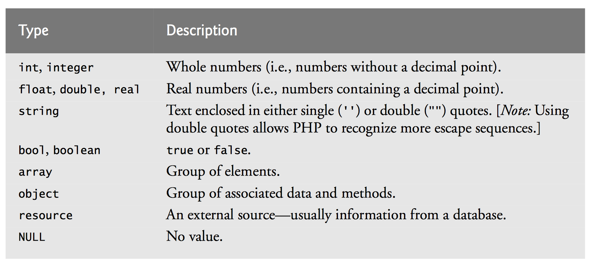
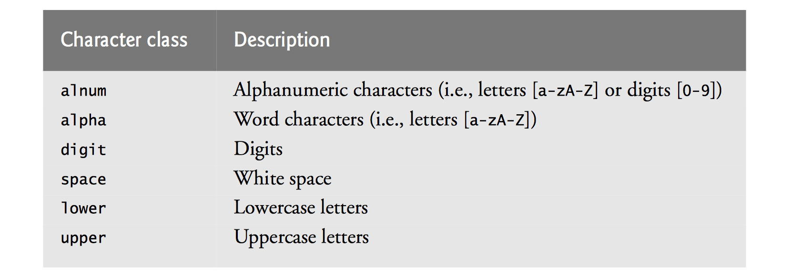
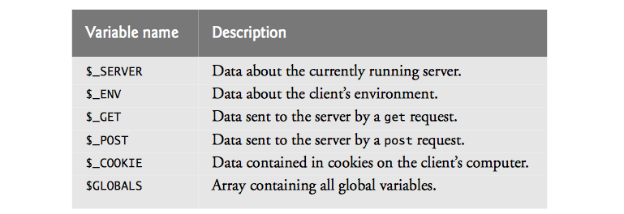

PHP
* Extremely common
* Open-source
* Platform independent

## Peliminaries
* php handles client requests
* php is embedded into HTML documents, but executes on the server *before* the html document is delivered to the client
* php files have the extension .php
* php code resides between `<?php /* PHP code */ ?>`
    * Single line php comments start with `//`
    * Multiline comments are enclosed with `/* */`
* Statements terminated with a semicolon `;` (required)

#### Variables
* Declared with `$name`
    * `name` must start with a letter or underscore
    * `name` can only contain `A-z`, `0-9`, and `_`
* Variables are case-sensitive
* Loosely typed
    * Similar idea as Javascript. Variables have  types, but their type can change on the fly
    * In PHP, we have to explicitly change types



Basic example:

```html
<!DOCTYPE html>
<!-- Fig. 19.1: first.php -->
<!-- Simple PHP program. -->
<html>
  <?php
    $name = "Paul"; // declaration and initialization
  ?><!-- end PHP script -->
  <head>
    <meta charset = "utf-8">
    <title>Simple PHP document</title>
  </head>
  <body>
    <!-- print variable name’s value -->
    <h1><?php print( "Welcome to PHP, $name!" ); ?></h1>
  </body>
</html>
```

Important notes:
* Line 6 declares a php variable named `name` and sets it equal to Paul
* Line 14 prints text into the `<h1>` tag **before the file is served to the client**
    * Note that the value of `$name` is printed, not the string "$name"
    * Double quoted strings will have variables evaluated (called *interpolating* a variable)
    * Single quoted strings will have the entire string taken as a literal value (no interpolation)

## Types and Conversion

```html
<!DOCTYPE html>
<!-- Fig. 19.3: data.php -->
<!-- Data type conversion. -->
<html>
  <head>
    <meta charset = "utf-8">
    <title>Data type conversion</title>
    <style type = "text/css">
    p
    { 
      margin: 0;
     }
    .head
    { 
      margin-top: 10px;
      font-weight: bold; 
    }
    .space 
    { 
      margin-top: 10px;
    }
    </style>
  </head>
  <body>
    <?php
    // declare a string, double and integer
    $testString = "3.5 seconds";
    $testDouble = 79.2;
    $testInteger = 12;
    ?><!-- end PHP script -->
    <!-- print each variable’s value and type -->
    <p class = "head">Original values:</p>
    <?php
      // . is the string concatencation operator
      print( "<p>$testString is a(n) " . gettype( $testString ) . "</p>" );
      print( "<p>$testDouble is a(n) " . gettype( $testDouble ) . "</p>" );
      print( "<p>$testInteger is a(n) " . gettype( $testInteger ) . "</p>" );
    ?><!-- end PHP script -->
    <p class = "head">Converting to other data types:</p>
    <?php
      // call function settype to convert variable
      // testString to different data types
      print( "<p>$testString " );
      settype( $testString, "double" );
      print( " as a double is $testString</p>" );
      print( "<p>$testString " );
      settype( $testString, "integer" );
      print( " as an integer is $testString</p>" );
      settype( $testString, "string" );
      print( "<p class = 'space'>Converting back to a string results in $testString</p>" );
      // use type casting to cast variables to a different type
      $data = "98.6 degrees";
      print( "<p class = 'space'>Before casting: $data is a " . gettype( $data ) . "</p>" );
      print( "<p class = 'space'>Using type casting instead:</p>
        <p>as a double: " . (double) $data . "</p>" .
        "<p>as an integer: " . (integer) $data . "</p>");
      print( "<p class = 'space'>After casting: $data is a " . gettype( $data ) . "</p>" );
    ?><!-- end PHP script -->
  </body>
</html>
```

* `gettype` gets the type of the parameter
* `settype` changes the type of first parameter to the second parameter
* Using `settype` can result in data loss: values may be truncated
    * For example, converting 3.5 to an int yields 3, and converting the int back to a double yields 3
    * Same thing happens with strings "3.5 seconds" as a double becomes 3.5
* Casting
    * Creates a temporary copy of the data before converting it
    * Means we won't lose data
    * Useful when a different type is required for a specific oepration, but you want to retain the original value
* String concatenation
    * Same as with javascript, but the operator is `.` 
* Contant values
    * Created with `define("NAME", value);`
    * Not a variable, a constant
    * Used by simply typing `NAME` where you want the value
* Conditionals 
    * Basically the same as Javscript, but `else if` is `elseif` (another keyword)
* Arthimetic Operations
    * Same as Javascript 

```html
<!DOCTYPE html>
<!-- Fig. 19.4: operators.php -->
<!-- Using arithmetic operators. -->
<html>
  <head>
    <meta charset = "utf-8">
    <style type = "text/css">
    p { margin: 0; }
    </style>
    <title>Using arithmetic operators</title>
  </head>
  <body>
    <?php
      $a = 5;
      print( "<p>The value of variable a is $a</p>" );
      
      // define constant VALUE
      define( "VALUE", 5 );
      
      // add constant VALUE to variable $a
      $a = $a + VALUE;
      print( "<p>Variable a after adding constant VALUE is $a</p>" );
      
      // multiply variable $a by 2
      $a *= 2;
      print( "<p>Multiplying variable a by 2 yields $a</p>" );
      
      // test if variable $a is less than 50
      if ( $a < 50 )
      {
        print( "<p>Variable a is less than 50</p>" );
      }

      // add 40 to variable $a
      $a += 40;
      print( "<p>Variable a after adding 40 is $a</p>" );
      
      // test if variable $a is 50 or less
      if ( $a < 51 )
      {
        print( "<p>Variable a is still 50 or less</p>" );
      } 
      elseif ( $a < 101 )
      {
        // $a >= 51 and <= 100
        print( "<p>Variable a is now between 50 and 100, inclusive</p>" );
      }
      else // $a > 100
      {
        print( "<p>Variable a is now greater than 100</p>" );
      }

      // print an uninitialized variable
      print( "<p>Using a variable before initializing: $nothing</p>" ); // nothing evaluates to ""
      
      // add constant VALUE to an uninitialized variable
      $test = $num + VALUE;
      
      // num evaluates to 0
      print( "<p>An uninitialized variable plus constant VALUE yields $test</p>" );
      
      // add a string to an integer
      $str = "3 dollars";
      $a += $str;
      print( "<p>Adding a string to variable a yields $a</p>" );
    ?><!-- end PHP script -->
  </body>
</html>

```

## Arrays
* PHP also supports arrays
    * Note that if an array does not exist, but is assigned, the array will be created
* PHP arrays may be *associative arrays*, meaning they have non-integer indicies
    * E.g. you index an array by a name, or by student ID number (stored as a string) 
* `reset` resets the internal pointer of the array to the beginning of the array
    * `key` returns the index of the element pointed to by the internal pointer
    * `next` moves the internal pointer down one element of the array
* `foreach` is specifically for iterating through arrays
    * `as` divides the key/value (key is on the left, value is on the right 

```html
<!DOCTYPE html>
<!-- Fig. 19.7: arrays.php -->
<!-- Array manipulation. -->
<html>
<head>
<meta charset = "utf-8">
<title>Array manipulation</title>
<style type = "text/css">
p
{ margin: 0; }
.head { margin-top: 10px; font-weight: bold; }
</style>
</head>
<body>
<?php
  // create array first
  print( "<p class = 'head'>Creating the first array</p>" );
  $first[ 0 ] = "zero";
  $first[ 1 ] = "one";
  $first[ 2 ] = "two";
  $first[] = "three";
  // print each element’s index and value
  for ( $i = 0; $i < count( $first ); ++$i )
    print( "Element $i is $first[$i]</p>" );
  print( "<p class = 'head'>Creating the second array</p>" );
  // call function array to create array second
  $second = array( "zero", "one", "two", "three" );
  for ( $i = 0; $i < count( $second ); ++$i )
    print( "Element $i is $second[$i]</p>" );
  print( "<p class = 'head'>Creating the third array</p>" );
  // assign values to entries using nonnumeric indices
  $third[ "Amy" ] = 21;
  $third[ "Bob" ] = 18;
  $third[ "Carol" ] = 23;
  // iterate through the array elements and print each
  // element’s name and value
  for ( reset( $third ); $element = key( $third ); next( $third ) )
    print( "<p>$element is $third[$element]</p>" );
  print( "<p class = 'head'>Creating the fourth array</p>" );
  // call function array to create array fourth using
  // string indices
  $fourth = array(
    "January"  => "first",
    "February" => "second",
    "March"  => "third",
    "April"  => "fourth",
    "May"  => "fifth",
    "June"  => "sixth",
    "July"  => "seventh",
    "August"  => "eighth",
    "September" => "ninth",
    "October"  => "tenth",
    "November"  => "eleventh",
    "December" => "twelfth" );
  // print each element’s name and value
  foreach ( $fourth as $element => $value )
    print( "<p>$element is the $value month</p>" );
?><!-- end PHP script -->
</body>
</html>

```

## String Comparisons
* `strcmp` compares two strings.
    * returns -1 if the first string alphabetically precedes the second string
    * returns 0 if the two strings are equal
    * returns 1 if the first string alphabetically follows the second string
* Can also use relational operators
    * `==, !=, <, <=, >, >=`

```html
<!DOCTYPE html>
<!-- Fig. 19.8: compare.php -->
<!-- Using the string-comparison operators. -->
<html>
<head>
<meta charset = "utf-8">
<title>String Comparison</title>
<style type = "text/css">
p { margin: 0; }
</style>
</head>
<body>
<?php
// create array fruits
$fruits = array( "apple", "orange", "banana" );
// iterate through each array element
for ( $i = 0; $i < count( $fruits ); ++$i )
{
  // call function strcmp to compare the array element
  // to string "banana"
  if (
    strcmp( $fruits[ $i ], "banana" ) < 0
  )
  print( "<p>" . $fruits[ $i ] . " is less than banana " );
  elseif ( strcmp( $fruits[ $i ], "banana" ) > 0 )
    print( "<p>" . $fruits[ $i ] . " is greater than banana ");
  else
    print( "<p>" . $fruits[ $i ] . " is equal to banana " );
  // use relational operators to compare each element
  // to string "apple"
  if ( $fruits[ $i ] < "apple" )
    print( "and less than apple!</p>" );
  elseif ( $fruits[ $i ] > "apple" )
    print( "and greater than apple!</p>" );
  elseif ( $fruits[ $i ] == "apple" )
    print( "and equal to apple!</p>" );
} // end for
?><!-- end PHP script -->
</body>
</html>

```

## Regular expressions!!
* There is no escape from regular expressions
* php uses the `preg_match` function to search for a string with the specified pattern
* Important regex characters
    * `^` means beginning of line
    * `$` means end of line
    * `[]` denotes a bracket expression
        * lists of characters
        * can specify a range with `-`
        * E.g. `[a-z]` are all characters a through z
    * Quantifiers
        * specifies a quanity to match with the previous expression
        * `*` means 'zero or more times'
        * `+` means 'one or more times'
        * `?` means 'zero or one times' 
        * `{n}` means 'exactly n times'
        * `{m,n}` means 'between m and n times'
        * `{n,}` means 'n or more times'
    * Character classes


```html
<!DOCTYPE html>
<!-- Fig. 19.9: expression.php -->
<!-- Regular expressions. -->
<html>
  <head>
    <meta charset = "utf-8">
    <title>Regular expressions</title>
    <style type = "text/css">
      p { margin: 0; }
    </style>
  </head>
  <body>
    <?php
      $search = "Now is the time";
      print( "<p>Test string is: '$search'</p>" );
      // call preg_match to search for pattern 'Now' in variable search
      if (
        preg_match( "/Now/", $search )
      )
      print( "<p>'Now' was found.</p>" );
      // search for pattern 'Now' in the beginning of the string
      if (
        preg_match( "/^Now/", $search )
      )
      print( "<p>'Now' found at beginning of the line.</p>" );
      // search for pattern 'Now' at the end of the string
      if (
        !preg_match( "/Now$/", $search )
      )
      print( "<p>'Now' was not found at the end of the line.</p>" );
      // search for any word ending in 'ow'
      if (
        preg_match( "/\b([a-zA-Z]*ow)\b/i", $search, $match )
      )
      print( "<p>Word found ending in 'ow': " .
      $match[ 1 ]
      . "</p>" );
      // search for any words beginning with 't'
      print( "<p>Words beginning with 't' found: " );
      while (
        preg_match( "/\b(t[[:alpha:]]+)\b/", $search, $match )
      )
      {
        print(
          $match[ 1 ]
          . " " );
        // remove the first occurrence of a word beginning
        // with 't' to find other instances in the string
        $search = preg_replace("/" . $match[ 1 ] . "/", "", $search);
      } // end while
      print( "</p>" );
    ?><!-- end PHP script -->
  </body>
</html>

```

## Form Processing 
### Superglobal Arrays
* Special arrays that contain client information
* Client information includes:
    * Client's web browser
    * Data sent to the server by the client `$_GET` and `$_POST`
        * E.g. if the user submit's a form and it is posted to a script (remember the `action` attribute), then the information is available in the `$_POST` array 
    * Cookies



### Example:

```html
<!DOCTYPE html>
<!-- Fig. 19.13: form.html -->
<!-- HTML form for gathering user input. -->
<html>
<head>
  <meta charset="utf-8">
  <title>Sample Form</title>
  <style type="text/css">
    label {
      width: 5em;
      float: left;
    }
  </style>
</head>
<body>
  <h1>Registration Form</h1>
  <p>Please fill in all fields and click Register.</p>
  <!-- post form data to form.php -->
  <form method="post" action="form.php">
    <h2>User Information</h2>
    <!-- create four text boxes for user input -->
    <div>
      <label>First name:</label>
      <input type="text" name="fname">
    </div>
    <div>
      <label>Last name:</label>
      <input type="text" name="lname">
    </div>
    <div>
      <label>Email:</label>
      <input type="text" name="email">
    </div>
    <div>
      <label>Phone:</label>
      <input type="text" name="phone" placeholder="(555) 555-5555">
    </div>
    <h2>Publications</h2>
    <p>Which book would you like information about?</p>
    <!-- create drop-down list containing book names -->
    <select name="book">
      <option>Internet and WWW How to Program</option>
      <option>C++ How to Program</option>
      <option>Java How to Program</option>
      <option>Visual Basic How to Program</option>
    </select>
    <h2>Operating System</h2>
    <p>Which operating system do you use?</p>
    <!-- create five radio buttons -->
    <p>
      <input type = "radio" name = "os" value = "Windows" checked>Windows
      <input type = "radio" name = "os" value = "Mac OS X">Mac OS X
      <input type = "radio" name = "os" value = "Linux">Linux
      <input type = "radio" name = "os" value = "Other">Other
    </p>
    <!-- create a submit button -->
    <p>
      <input type = "submit" name = "submit" value = "Register">
    </p>
  </form>
  </body>
</html>
```

Let's break down this form (it's been a while)
* It uses the `POST` HTTP method to send data to `form.php` 
* It has the following inputs:
    * `fname` (text)
    * `lname` (text)
    * `email` (text)
    * `phone` (text)
    * `book` (options)
    * `os` (radio)
* So when we hit `Register` (the `submit` input), we will send the inputs to `form.php` using the `$_POST` superarray
    * Had we used the `GET` method we'd see values in the `$_GET` superarray 
* The input names are the glue; the register an input to an entry in the superarray
    * This is why names mattered in chapter 2/3!!
    
### Here's `form.php`

```html
<!DOCTYPE html>
<!-- Fig. 19.14: form.php -->
<!-- Process information sent from form.html. -->
<html>
  <head>
    <meta charset = "utf-8">
    <title>Form Validation</title>
    <style type = "text/css">
      p
      { margin: 0px; }
      .error
      { color: red }
      p.head { font-weight: bold; margin-top: 10px; }
    </style>
  </head>
  <body>
    <?php
    // determine whether phone number is valid and print
    // an error message if not
    // regex looks for the following pattern "(###) ###-####" 
    if (!preg_match( "/^\([0-9]{3}\) [0-9]{3}-[0-9]{4}$/", $_POST["phone"]))
    {
      print( "<p class = 'error'>Invalid phone number</p>
        <p>A valid phone number must be in the form
        (555) 555-5555</p><p>Click the Back button,
        enter a valid phone number and resubmit.</p>
        <p>Thank You.</p></body></html>" );
      die(); // terminate script execution
    }
    ?><!-- end PHP script -->
    <p>
      <!-- Access information from the submission using the $_POST superarray -->
      Hi <?php print( $_POST["fname"] ); ?>. Thank you for completing the survey. You have been added to the
      <?php print( $_POST["book"] ); ?>mailing list.
    </p>
    <p class = "head">
      The following information has been saved in our database:
    </p>
    <p>Name: <?php print( $_POST["fname"] ); print( " " . $_POST["lname"] ); ?></p>
    <p>Email: <?php print( $_POST["email"] ); ?></p>
    <p>Phone: <?php print( $_POST["phone"] ); ?></p>
    <p>OS: <?php print( $_POST["os"] ); ?></p>
    <p class = "head">
      This is only a sample form. You have not been added to a mailing list.
    </p>
  </body>
</html>

```

* This validates the phone number!
    * Very important to validate your form inputs 
* `die()` terminates the script, stops processing the form

## Querying Databases through PHP

```html
<!DOCTYPE html>
<!-- Fig. 19.15: data.html -->
<!-- Form to query a MySQL database. -->
<html>
  <head>
    <meta charset = "utf-8">
    <title>Sample Database Query</title>
  </head>
  <body>
    <h1>Querying a MySQL database.</h1>
    <form method = "post" action = "database.php">
      <p>Select a field to display:
      <!-- add a select box containing options -->
      <!-- for SELECT query -->
        <select name = "select">
          <option selected>*</option>
          <option>ID</option>
          <option>Title</option>
          <option>Category</option>
          <option>ISBN</option>
        </select>
      </p>
      <p>
        <input type = "submit" value = "Send Query">
      </p>
    </form>
  </body>
</html>

```

### `database.php`

```html
<!DOCTYPE html>
<!-- Fig. 19.16: database.php -->
<!-- Querying a database and displaying the results. -->
<html>
  <head>
    <meta charset = "utf-8">
    <title>Search Results</title>
    <style type = "text/css">
      body
      { font-family: sans-serif;
      background-color: lightyellow; }
      table { background-color: lightblue;
      border-collapse: collapse;
      border: 1px solid gray; }
      td
      { padding: 5px; }
      tr:nth-child(odd) {
      background-color: white; }
    </style>
  </head>
  <body>
    <?php
      $select = $_POST["select"]; // creates variable $select
      // build SELECT query
      $query = "SELECT " . $select . " FROM books";
      // Connect to MySQL
      if ( !( $database = mysql_connect( "localhost", "iw3htp", "password" ) ) )
        die( "Could not connect to database </body></html>" );
      // open Products database
      if ( !mysql_select_db( "products", $database ) )
        die( "Could not open products database </body></html>" );
      // query Products database
      if ( !( $result = mysql_query( $query, $database ) ) )
      {
        print( "<p>Could not execute query!</p>" );
        die( mysql_error() . "</body></html>" );
      } // end if
      mysql_close( $database );
    ?><!-- end PHP script -->
    <table>
      <caption>Results of "SELECT <?php print( "$select" ) ?>
      FROM books"</caption>
      <?php
        // fetch each record in result set
        while (
          $row = mysql_fetch_row( $result )
        )
        {
          // build table to display results
          print( "<tr>" );
          foreach ( $row as $key => $value )
            print( "<td>$value</td>" );
          print( "</tr>" );
        } // end while
      ?><!-- end PHP script -->
      </table>
      <p>
        Your search yielded <?php print( mysql_num_rows( $result )) ?> results.
      </p>
    <p>
      Please email comments to <a href = "mailto:deitel@deitel.com">Deitel and Associates, Inc.</a>
    </p>
  </body>
</html>

```

* This assumed we followed the Chapter 18 instructions for setting up MySQL
    * Includes source-ing the `products.sql` file
* `mysql_connect` connects to the database
* `mysql_select_db` opens the `products` database
* `mysql_query` executes a MySQL query (what we learned about in chatper 18)
* `mysql_close` closes the database
* `mysql_fetch_row` returns an associative array containing the column of the current row from the query result
    * The `key` is a unique column ID for the query
* `mysql_fecth_assoc` returns an associative array where the column names are the keys storing the corresponding values
* `mysql_num_rows` stores the number of rows in the query result

## Cookies
* What is a cookie?
    * A piece of information from the server that resides on the client's computer
    * Just a text file
    * Maintains information about the client in between browsing sessions
        * Cookies mean you don't have to login everytime you visit a website
        * The cookie stores your login session (not password), basically meaning the website assumes you are the same user
    * You can disable cookies if you want, but it makes browsing significantly more annoying!
    * Can also track other client activity
* Cookies are text files
    * Should never store passwords, credit card info, etc
* Cookies are only accessible by the website that placed the cookie on the client's computer
* Cookies have an expiration date - at which point the browser will delete the cookie off of the client's computer
* Cookies are sent back to the originating server when the user connects to that server

```html
<!DOCTYPE html>

<!-- Fig. 19.17: cookies.html -->
<!-- Gathering data to be written as a cookie. -->
<html>
   <head>
      <meta charset = "utf-8">
      <title>Writing a cookie to the client computer</title>
      <style type = "text/css">
         label { width: 7em; float: left; }
      </style>
   </head>
   <body>
      <h2>Click Write Cookie to save your cookie data.</h2>   
      <form method = "post" action = "cookies.php"> 
         <div><label>Name:</label> 
            <input type = "text" name = "name"><div>
         <div><label>Height:</label>
            <input type = "text" name = "height"></div>
         <div><label>Favorite Color:</label>
            <input type = "text" name = "color"></div>
         <p><input type = "submit" value = "Write Cookie">
      </form>
   </body>
</html>
```

```html
<!-- Fig. 19.18: cookies.php -->
<!-- Writing a cookie to the client. -->
<?php 
   define( "FIVE_DAYS", 60 * 60 * 24 * 5 ); // define constant

   // write each form field's value to a cookie and set the 
   // cookie's expiration date
   setcookie( "name", $_POST["name"], time() + FIVE_DAYS );    
   setcookie( "height", $_POST["height"], time() + FIVE_DAYS );
   setcookie( "color", $_POST["color"], time() + FIVE_DAYS );  
?><!-- end PHP script -->

<!DOCTYPE html>

<html>
   <head>
      <meta charset = "utf-8">
      <title>Cookie Saved</title>
      <style type = "text/css">
         p { margin: 0px; }
      </style>
   </head>
   <body>
      <p>The cookie has been set with the following data:</p>
      
      <!-- print each form field's value -->
      <p>Name: <?php print( $_COOKIE["name"] ) ?></p>          
      <p>Height: <?php print( $_COOKIE["height"] ) ?></p>         
      <p>Favorite Color: 
         <span style = "color: <?php print( $_COOKIE["color"] ) ?> ">
         <?php print( $_COOKIE["color"] ) ?></span></p>      
      <p>Click <a href = "readCookies.php">here</a>
         to read the saved cookie.</p>
   </body>
</html>
```

* `setcookie` creates a cookie
    * First parameter is the name
    * Second parameter is the data
    * Third parameter is the expiration date
        * If there is no expiration date, the cookie is a *session cookie*, which means it only exists during the current browsing session (when the user closes the browser, the session ends)
        * If a expiration date is specified, we call this cookie a *persistent cookie*
* Cookies are then accessible through the `$_COOKIE` superarray 

```html
<!DOCTYPE html>

<!-- Fig. 19.19: readCookies.php -->
<!-- Displaying the cookie's contents. -->
<html>
   <head>
      <meta charset = "utf-8">
      <title>Read Cookies</title>  
      <style type = "text/css">
         p { margin: 0px; }
      </style>
   </head>
   <body>
      <p>The following data is saved in a cookie on your computer.</p>
      <?php
         // iterate through array $_COOKIE and print
         // name and value of each cookie
         foreach ($_COOKIE as $key => $value )
            print( "<p>$key: $value</p>" );
      ?><!-- end PHP script -->
   </body>
</html>
```

```html

```

